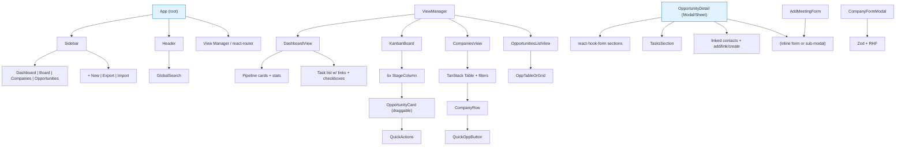

# JobTracker Design Document

**App Name:** JobTracker  
**Version / Scope:** MVP v1 (standalone local-first web application)  
**Date:** 2026-06-15  
**Status:** Design complete; ready for implementation via PR plan  
**Author:** Systems Architect (based on user requirements + clarifications)

---

## Introduction

JobTracker is a focused, high-signal personal CRM and pipeline tool for serious job seekers. It emphasizes company-centric tracking: users maintain a "target list" of companies (with rich metadata like AI-native status, funding, headcount) and can track multiple opportunities (different roles, teams, or applications) against each. A fixed-stage Kanban provides visual workflow for the full lifecycle.

The app is **pure client-side, standalone, no server or auth**. All data lives on the user's machine via browser storage with explicit export/backup. It prioritizes daily usability: fast entry, drag-and-drop progression, live due-date awareness, rich contact/meeting notes for relationship tracking, and compensation/equity visibility.

Differentiators preserved from requirements:
- Deep company metadata (AI-native flag prominent).
- Multi-opportunity per company with clear primary + optional "via" (contracting/staffing firm) modeling.
- Full CRM elements: company-owned contacts linkable to opportunities + unlimited per-opportunity meetings.
- Lightweight task lists per opportunity (with "next action" promoted automatically as the top open task by due date).
- Rich fields for comp (OTE, equity), title expectations, work mode, source, priority.

This document provides concrete, implementation-ready specifications including exact data shapes, enums, component structure, persistence strategy, and an incremental PR plan.

---

## Goals and Non-Goals

### Goals (MVP)
- Track companies with metadata and AI-native highlighting.
- Track opportunities belonging to (primary) companies, with optional via_company for staffing/contracting firms.
- Fixed 6-stage Kanban with full drag-and-drop to change pipeline stage.
- Per-opportunity lightweight tasks (title, due, done) + automatic "next action" promotion (earliest-due open task).
- Contacts owned by companies (1:N), linkable to opportunities.
- Unlimited meetings per opportunity with structured log (date, type, attendees, notes, outcome).
- Dashboard: pipeline counts/visual + sorted list of upcoming/overdue tasks with direct links.
- Companies table: quick-add, search, AI-native filter, quick "create opportunity" action.
- Opportunity detail: complete editable record + inline/sections for tasks, contacts (add/link/remove), chronological meeting log + add.
- Full local persistence: auto-save to localStorage + one-click JSON export/import + optional direct File System Access API file-backed persistence (Chromium).
- Excellent desktop-first UX: fast forms, keyboard-friendly, clear visual cues (overdue, AI-native badges, priority), responsive but optimized for laptop/desktop.
- All data exportable as structured JSON (primary) + CSV for companies/opportunities.

### Non-Goals (MVP – explicitly deferred)
- No AI features, autofill, resume tools, browser extensions, calendar sync, push notifications, or reminders.
- No multi-user, cloud sync, accounts, or collaboration.
- No custom pipeline stages or advanced analytics (basic counts + upcoming only).
- No attachments/uploads (text only), import from external sources (LinkedIn etc.), or external API integrations.
- No soft-delete/restore UI beyond basic delete with confirmation; no activity audit log.
- No packaging as desktop app (Tauri/Electron) in v1 (pure web; can be opened via `vite preview` or static host; future wrapper possible).
- No PWA install or offline service worker beyond basic localStorage.

---

## Core Features and User Stories

- As a user, I can maintain a list of target companies with rich attributes and quickly spot AI-native ones.
- As a user, I can add multiple opportunities per company (e.g., different roles or via recruiters) and see all of them progressing independently.
- As a user, I can drag opportunities across the fixed Kanban stages to update their status in one action.
- As a user, I can maintain a small checklist of tasks per opportunity; the "next action" is always the highest-priority open task (by due date).
- As a user, I can log contacts at the company level and associate them with specific opportunities for context.
- As a user, I can log unlimited meetings with full details and review them chronologically in the opportunity view.
- As a user, I see an at-a-glance dashboard of my pipeline health and what is due soonest (with overdue highlighting).
- As a user, I can export my entire dataset as JSON for backup/versioning/git and restore it later; optionally work against a real local `.json` file.
- As a user, from a company row I can instantly spin up a new opportunity for it (primary company pre-selected).

---

## Data Model

All entities use:
- `id: string` (UUID via `crypto.randomUUID()`)
- `created_at: string` (ISO 8601)
- `updated_at: string` (ISO 8601, updated on any mutation)

### Exact TypeScript Interfaces (v1)

```ts
// Enums (exact, fixed for v1)
export type PipelineStage =
  | 'Researching'
  | 'Applied'
  | 'Interviewing'
  | 'Offer'
  | 'Closed Won'
  | 'Closed Lost';

export type RoleType = 'Full-time' | 'Contract' | 'Internship' | 'Other';

export type WorkMode = 'Remote' | 'Hybrid' | 'Onsite';

export type TitleBump = 'Same' | 'Medium' | 'Large';

export type FundingStage =
  | 'Unknown'
  | 'Bootstrapped'
  | 'Pre-seed'
  | 'Seed'
  | 'Series A'
  | 'Series B'
  | 'Series C'
  | 'Series D+'
  | 'Growth'
  | 'Public';

export type MeetingType = 'Phone' | 'Video' | 'Onsite' | 'Other';

export type Priority = 'High' | 'Medium' | 'Low';

// Core entities
export interface Company {
  id: string;
  name: string;
  website: string | null;           // e.g. "https://example.com" or null
  industry: string | null;
  funding_stage: FundingStage;
  headcount: number | null;         // exact or best estimate; UI derives buckets
  ai_native: boolean;
  hq_location: string | null;       // "San Francisco, CA" or "Remote-first"
  notes: string | null;
  created_at: string;
  updated_at: string;
  // Embedded (owned)
  contacts: Contact[];
}

export interface Contact {
  id: string;
  name: string;
  title: string | null;
  linkedin: string | null;          // full URL or handle
  notes: string | null;             // relationship notes
  created_at: string;
  updated_at: string;
}

export interface Opportunity {
  id: string;
  company_id: string;               // Primary target company (required; the one you want to work at)
  via_company_id: string | null;    // Optional contracting/staffing firm (e.g. IDR)
  role_title: string;
  role_type: RoleType;
  stage: PipelineStage;
  job_url: string | null;
  location: string | null;          // City, "Remote", "SF / NYC hybrid", etc.
  source: string | null;            // Free text or selected: "LinkedIn", "Referral", "Recruiter", etc.
  priority: Priority;
  ote: number | null;               // Annual OTE in USD (e.g. 185000)
  equity: string | null;            // e.g. "0.05%", "50k RSUs over 4y", "TBD"
  title_bump: TitleBump;
  work_mode: WorkMode;
  why_interested: string | null;
  notes: string | null;             // Freeform context/notes (separate from why_interested + meetings/tasks)
  applied_at: string | null;        // ISO; set manually or auto on first move to "Applied"
  created_at: string;
  updated_at: string;
  // Embedded (owned by this opp)
  tasks: Task[];
  meetings: Meeting[];
  // Links (by id) to contacts owned by company_id or via_company_id
  contact_ids: string[];
}

export interface Task {
  id: string;
  title: string;
  due: string | null;               // ISO date (YYYY-MM-DD) or datetime; null = no due
  done: boolean;
  created_at: string;
  updated_at: string;
}

export interface Meeting {
  id: string;
  date: string;                     // ISO (YYYY-MM-DD or full datetime)
  type: MeetingType;
  attendees: string;                // Free-text names / "Jane (Recruiter), John (Hiring Manager)"
  notes: string | null;
  outcome: string | null;           // Short summary or "Positive", "Next steps: onsite", etc.
  created_at: string;
  updated_at: string;
}

// Root application state (single JSON blob)
export interface AppData {
  version: 1;                       // Schema version for future migrations
  companies: Company[];
  opportunities: Opportunity[];
  // No top-level contacts/meetings/tasks — they are embedded for simplicity
  meta?: {
    last_exported_at?: string;
    // Future: preferences
  };
}
```

**Notes on modeling:**
- **Contracting / via flexibility**: `company_id` is always the primary "I want to work here" company. `via_company_id` points to a different Company record (the staffing firm). Both are valid FKs into `companies`. When filtering/viewing "opportunities at Company X", include any opp where `company_id === X || via_company_id === X`.
- **Company identity / uniqueness**: No DB-level or hard unique constraint (name or name+website). See Key Decisions for soft-warning policy implemented in add/updateCompany + UI. Use `notes` on Company to disambiguate when dups are intentionally created. Queries and related-opps logic treat by id only (dupe names are user's responsibility to manage).
- Contacts are strictly owned by a Company (embedded). An opportunity links to a subset via `contact_ids` (only contacts belonging to its primary or via company are valid to link; UI enforces/enables appropriately).
- `notes` on Opportunity: freeform context separate from `why_interested` (which captures motivation for the role/company) and from meetings/tasks. Added for practicality as low-cost field common in job tracking.
- Tasks: "next action" is derived client-side: the first (by `due` ascending, nulls last) task where `done === false`. Display prominently in cards, dashboard, and opp header. If no open tasks, show "No open tasks" or allow quick-add.
- All dates are strings (ISO) for easy JSON serialization. UI uses date-fns for parsing/formatting/comparison.
- `headcount`: store as integer (e.g. 250). UI bucket logic for filters/display: `<=10`, `11-50`, `51-200`, `201-500`, `501-2000`, `>2000`.
- Delete semantics: see dedicated subsection below (primary opps removed; via-only null'ed; contacts + dangling links cleaned). No hard cascade in JSON model; all handled in store logic.

### Delete Semantics
`deleteCompany(id)` (implemented in store, called from UI) follows this safe policy to support contracting use cases without accidental data loss on primary targets:

- Identify affected:
  - `primaryOpps` = opportunities where `company_id === id` (these are "I want to work at this company" records).
  - `viaOpps` = opportunities where `via_company_id === id` but `company_id !== id` (staffing firm case; the primary target remains valid).
- Behavior:
  - Fully remove the Company record (and its embedded `contacts[]`).
  - For each in `primaryOpps`: remove the entire Opportunity (and its embedded tasks/meetings).
  - For each in `viaOpps`: set `via_company_id = null` on the Opportunity (keeps the record, just removes the "via" reference). Update the opp's `updated_at`.
  - For *all remaining opportunities* (after the above): filter their `contact_ids` to remove any ids that belonged to the deleted company's contacts (clean dangling links).
- Return value: `DeleteCompanySummary = { companyId: string, removedPrimaryOpps: number, nulledViaOpps: number, deletedContacts: number, cleanedContactLinks: number, affectedOppIds: string[] }` for use in confirmation UI and toasts.
- UI (Companies): "Delete" shows confirm dialog with summary e.g. "Deleting 'IDR Staffing' will: remove 0 primary opps, null via on 2 opps, delete 5 contacts, clean 3 links in other records. This cannot be undone. Proceed?" (counts from summary).
- Invariants maintained: no orphaned via refs to non-existent companies; no contact_ids pointing to deleted contacts; primary opps are only removed when their target company is intentionally deleted.
- Implementation: pure function in utils + store action in PR2 (unit tested with cases for via-only, linked contacts, primary+via mix). Called only after user confirms in PR3+ UI.
- Note: There is no "delete contact" that cascades to links (unlink only); deleting opp cleans its own tasks/meetings (no cross-opp impact).

### Mermaid ERD (Entity Relationship Diagram)

```mermaid
erDiagram
    COMPANY ||--o{ OPPORTUNITY : "primary (company_id)"
    COMPANY ||--o{ OPPORTUNITY : "via (via_company_id, optional)"
    COMPANY ||--o{ CONTACT : "owns (embedded)"
    OPPORTUNITY ||--o{ TASK : "has (embedded)"
    OPPORTUNITY ||--o{ MEETING : "has (embedded)"
    OPPORTUNITY ..o CONTACT : "links (via contact_ids; logical link, not ownership; contacts are embedded under Company)"
    
    COMPANY {
        string id PK
        string name
        string website
        string industry
        string funding_stage
        int headcount
        boolean ai_native
        string hq_location
        string notes
        datetime created_at
        datetime updated_at
    }
    OPPORTUNITY {
        string id PK
        string company_id FK
        string via_company_id FK
        string role_title
        string role_type
        string stage
        string job_url
        string location
        string source
        string priority
        int ote
        string equity
        string title_bump
        string work_mode
        string why_interested
        string notes
        datetime applied_at
        datetime created_at
        datetime updated_at
        string[] contact_ids
    }
    CONTACT {
        string id PK
        string name
        string title
        string linkedin
        string notes
        datetime created_at
        datetime updated_at
    }
    TASK {
        string id PK
        string title
        date due
        boolean done
        datetime created_at
        datetime updated_at
    }
    MEETING {
        string id PK
        datetime date
        string type
        string attendees
        string notes
        string outcome
        datetime created_at
        datetime updated_at
    }
```

**Diagram note**: Mermaid ERD validated for render in mermaid.live editor (as of 2026-06). Uses logical ".." link notation for application-level contact associations (contacts are embedded under Company in the actual model; the relationship is shown for clarity of linking behavior). Attribute types simplified (e.g. "string" covers string|null cases; "int" for headcount aligns with number|null in TS).
### Example Full AppData Shape (abbreviated)

```json
{
  "version": 1,
  "companies": [
    {
      "id": "c_abc123",
      "name": "Acme AI",
      "website": "https://acme.ai",
      "industry": "AI Infrastructure",
      "funding_stage": "Series B",
      "headcount": 180,
      "ai_native": true,
      "hq_location": "San Francisco, CA",
      "notes": "Strong engineering culture. Focus on inference optimization.",
      "created_at": "2026-01-10T09:00:00.000Z",
      "updated_at": "2026-02-15T14:22:00.000Z",
      "contacts": [
        {
          "id": "ct_001",
          "name": "Priya Sharma",
          "title": "Engineering Manager, ML Platform",
          "linkedin": "https://linkedin.com/in/priyasharma",
          "notes": "Met at NeurIPS. Referred me for role.",
          "created_at": "...",
          "updated_at": "..."
        }
      ]
    }
  ],
  "opportunities": [
    {
      "id": "o_def456",
      "company_id": "c_abc123",
      "via_company_id": null,
      "role_title": "Senior ML Engineer - Inference",
      "role_type": "Full-time",
      "stage": "Interviewing",
      "job_url": "https://acme.ai/careers/123",
      "location": "SF / Hybrid",
      "source": "Referral",
      "priority": "High",
      "ote": 235000,
      "equity": "0.08% over 4 years",
      "title_bump": "Medium",
      "work_mode": "Hybrid",
      "why_interested": "Leading work on efficient inference at scale + great comp.",
      "notes": "Additional context: referred by alumni; open to discussing remote-first options.",
      "applied_at": "2026-02-03T00:00:00.000Z",
      "created_at": "2026-02-01T11:30:00.000Z",
      "updated_at": "2026-02-20T09:15:00.000Z",
      "tasks": [
        {
          "id": "t_01",
          "title": "Prep system design for inference serving",
          "due": "2026-02-25",
          "done": false,
          "created_at": "...",
          "updated_at": "..."
        },
        {
          "id": "t_02",
          "title": "Send thank you to Priya",
          "due": "2026-02-18",
          "done": true,
          "created_at": "...",
          "updated_at": "..."
        }
      ],
      "meetings": [
        {
          "id": "m_99",
          "date": "2026-02-10T14:00:00.000Z",
          "type": "Video",
          "attendees": "Priya Sharma (EM), Alex Rivera (Staff SWE)",
          "notes": "Discussed current inference stack and team growth plans.",
          "outcome": "Strong interest. Onsite scheduled for next week.",
          "created_at": "...",
          "updated_at": "..."
        }
      ],
      "contact_ids": ["ct_001"]
    }
  ]
}
```

---

## UI Architecture and Screens

**Navigation:** Persistent left sidebar (desktop) or top nav (narrow). Items:
- Dashboard
- Kanban Board
- Companies
- Opportunities (flat list view)

Global header: App title/logo, global search (filters current view or global), + New Opportunity (or New Company), Export / Import / Settings (file mode indicator), user/theme toggle (light/dark via Tailwind).

**Primary Views (main content area):**
1. **Dashboard** (default/home)
   - Pipeline overview: 6 cards/columns or a compact horizontal progress (counts + percentage of total active). Clickable stages jump to filtered Kanban.
   - Key stats: Total companies, Total opps, Active pipeline (Researching+Applied+Interviewing+Offer), Closed Won rate (simple), # AI-native targets.
   - Upcoming actions: Prioritized list/table of open tasks across all opps, sorted by due date (overdue first in red, then soon). Each row: checkbox (toggle done), task title, due (relative or absolute + overdue badge), opp role+company link (click opens detail), priority indicator. "Promoted next action" highlighted.
   - Quick links or "at risk" (opps in Researching >30 days with no tasks, etc.).

2. **Kanban Board**
   - Horizontal 6 fixed columns (Researching → Closed Lost). Scrollable on narrow screens.
   - Each column header: Stage name + count.
   - Cards: Compact, draggable. Content: role_title (bold), company name (with small AI-native badge if true + via indicator if present), priority badge, ote/equity summary if set, "Next: <task title> (due)" or "No open tasks", # meetings or recent date, location/source short.
   - Drag card between columns → immediately updates `stage`, sets `updated_at`, auto-sets `applied_at` if moving into Applied (or later) and not already set. Optimistic UI + persistence.
   - Column drop zones accept cards; visual feedback on drag-over.
   - Click card → opens Opportunity Detail (see below).
   - + Add Opportunity button per column (prefills stage).

3. **Companies**
   - Toolbar: Search (name, industry, notes), Filter: All / AI-native only, Sort (name, headcount, #opps, updated), Quick Add Company button.
   - Add/Edit (CompanyFormModal): name required; on submit, store performs soft dupe check (name+website fuzzy); if warning returned, show inline + toast (non-fatal; allows save). "Similar existing: ..." list with "Edit that instead" action.
   - Table (TanStack Table recommended for sort/filter/pagination if >50): 
     - Name (clickable → company detail or filtered opps)
     - Website (external link)
     - Industry
     - AI-native (prominent colored pill/badge: emerald for true)
     - Funding / Headcount (formatted)
     - HQ Location
     - # Opps (primary + via count; clickable → filtered Opportunities or Kanban)
     - Updated
     - Actions: Edit | Add Opportunity (opens opp form with company prefilled as primary) | Delete (with confirm dialog showing DeleteCompanySummary: affected primary opps / nulled via / contacts / links)
   - Card view toggle optional for mobile.

4. **Opportunities (list)**
   - Search + filters (stage multi-select, company, priority, has open tasks, via/primary, date ranges).
   - Sortable table or grid: similar columns to cards + stage pill + next action due.
   - Bulk actions (MVP stretch): multi-select → change stage / add task / close.
   - Row click or "Details" opens Opportunity Detail.

**Opportunity Detail View**
- Opens as large modal, right Sheet/Drawer (preferred for desktop feel – shadcn/ui Sheet or custom), or dedicated route view with back button. Supports full editing.
- Header: Role title + company (primary) [via Company if present] + stage pill (editable dropdown) + priority.
- Main editable form (grouped sections for scannability):
  - Basics: role_title, role_type (select), job_url (link), location, source, work_mode (select), priority.
  - Compensation: ote (number input with $), equity (text), title_bump (select).
  - Interest & Context: why_interested (textarea), notes (freeform optional textarea for general context beyond why_interested, e.g. follow-up details or constraints).
  - Timeline: created, applied_at (date picker; editable), updated.
- Derived / Promoted: **Next Action** banner (top open task or "Add task").
- Sections (collapsible or always visible, scrollable area):
  - **Tasks** (lightweight): Add form (title + optional due date). List of tasks (checkbox, title, due with overdue, delete). Sort by done then due. "Promote" logic visible.
  - **Contacts**: List of linked (from primary/via company's contacts). Add/link: combobox of available contacts from the two companies (create new contact inline → adds to the primary company by default, then links). Remove link (does not delete contact). "Manage contacts at <Company>" link.
  - **Meetings Log**: Chronological (newest first or oldest first toggle). Each entry card: date, type badge, attendees, outcome, notes. "Add Meeting" inline form (or sub-modal): date (default today), type select, attendees (text), notes, outcome. Auto appends with created_at.
- Footer actions: Delete opportunity (confirm), Duplicate, Close.
- All changes auto-save to store (live or on blur with debounce) → immediate persist.
- Keyboard: Esc closes, Cmd/Ctrl+S explicit save (though auto), Tab through fields.

**Company Detail** (lighter): From companies list or opp, view/edit company metadata + list of all its contacts (add/edit inline) + list of related opportunities (primary or via, with stage links to Kanban or detail).

**Modals (lightweight):**
- CompanyForm (add/edit – name required, others optional).
- Quick task add (from board card or dashboard).
- Import wizard (see Import/Export Safety and UX: file select + safety backup + validate + preview counts/mode choice (replace vs merge) + final confirm). Core logic in persistence (PR2); UI in PR7.

**Visual Language (Tailwind + shadcn):**
- AI-native: emerald-500/600 badge with "AI" icon (lucide Sparkles or Brain).
- Stages: consistent color mapping (e.g. Researching=slate, Applied=blue, Interviewing=amber, Offer=green, Closed Won=emerald, Closed Lost=rose).
- Overdue: red text/border + "Overdue" tag.
- Due soon (<3 days): amber.
- Cards/rows: subtle borders, hover lift, focus rings.
- Dark mode supported from day 1.

### Mermaid: High-Level UI / Component Hierarchy



**Diagram note**: Mermaid UI hierarchy diagram validated for render in mermaid.live. All nodes use consistent ["label"] syntax. "..." was completed for clarity.

### Key User Flows (Concrete)

1. **Drag to progress**: On Board → drag card from "Applied" → "Interviewing" column. On drop: `updateOpportunity(id, {stage: 'Interviewing', updated_at: now})`. If no `applied_at`, set it. Re-render columns instantly. Persist.
2. **Add task + promote next**: In opp detail or from card hover/quick → add task "Send follow-up email" due "2026-03-01". Store updates opp.tasks. Dashboard and cards recompute "next action" = min open by due.
3. **Company → Opportunity**: Companies table row "Add Opportunity" → opens detail/form with company_id prefilled, stage="Researching", focus on role_title. Optionally set via_company via select.
4. **Link contact**: Opp detail → Contacts section "Link existing" → filtered list from primary + via companies → select → push id to contact_ids. Or "New contact at Acme" → adds to company.contacts, auto-links.
5. **Add meeting**: Detail → + Meeting → fill form → appends to opp.meetings (sorted on render).
6. **Restore from backup**: Settings/Import → (auto-offer timestamped export of current first) → select .json → validate (fail keeps current data) → preview (counts + replace/merge choice) → confirm → execute (per exact merge semantics or full replace) + summary toast. See "Import/Export Safety and UX".
7. **Via company example**: Create "IDR Staffing" as company. Create opp with company_id=Acme, via_company_id=IDR. Both companies show the opp in their "related opportunities".

---

## Technical Architecture

**Recommended Stack (concrete):**
- **Build / Framework**: Vite 6+ + React 18/19 + TypeScript (strict).
- **Styling**: Tailwind CSS v4 + shadcn/ui (Radix UI primitives under the hood) + lucide-react icons.
- **Routing / Views**: react-router-dom (BrowserRouter + Routes; consider HashRouter for pure file:// compatibility later).
- **State**: Zustand (lightweight, middleware for persist + devtools). Single `useAppStore`.
- **Forms**: react-hook-form + @hookform/resolvers/zod + zod for runtime validation + schemas (mirrors TS types).
- **Tables**: @tanstack/react-table (for Companies + Opportunities lists).
- **Drag & Drop**: @hello-pangea/dnd (Kanban columns + cards; beautiful, accessible, list-optimized, maintained fork).
- **Dates / Utils**: date-fns (formatting, comparison, addDays, parseISO).
- **UI Primitives / Extras**: shadcn components (Button, Input, Select, Dialog, Sheet, Table, Badge, Calendar, Popover, Combobox, etc.), sonner for toasts (non-blocking feedback), cmdk for command palette search if time.
- **Dev / Quality**: ESLint + Prettier + TypeScript, Vitest + React Testing Library (for store/utils), simple Playwright or manual for flows.

**Folder Structure (proposed):**
```
src/
  components/
    ui/                 # shadcn copied components
    layout/             # Sidebar, Header, AppShell
    kanban/             # Board, StageColumn, OpportunityCard
    companies/          # CompanyTable, CompanyForm, CompanyRow
    opportunities/      # OppList, OppForm (or shared), OppDetailSheet
    dashboard/
    common/             # TaskList, MeetingLog, ContactLinker, DueBadge
  lib/
    types.ts            # All interfaces + enums + Zod schemas
    store.ts            # zustand create + actions + selectors
    persistence.ts      # exportJSON, importJSON, LS helpers, FS API wrapper
    utils.ts            # nextActionForOpp, filterOppsByCompany, formatHeadcount, isOverdue, etc.
    constants.ts        # STAGES array, ROLE_TYPES, etc.
  hooks/
    useDebouncedSave.ts
    useKeyboardShortcuts.ts
  App.tsx
  main.tsx
```

**State & Persistence Layer**
- Zustand store holds full `AppData` (or normalized view + actions that keep it consistent).
- Middleware or custom subscribe: on any change (after debounce 300-500ms), write to `localStorage.setItem('jobtracker:data', JSON.stringify(data))`.
- Load on mount: try LS, fallback to empty + optional seed.
- Actions are explicit: `addCompany`, `updateOpportunity(id, patch)`, `addTaskToOpp(oppId, taskData)`, `moveOppStage(oppId, newStage)`, `linkContact(oppId, contactId)`, `deleteCompany(id)` (returns DeleteCompanySummary), etc. All set `updated_at` on affected entities and trigger persist. See full "Store API Surface (excerpt)" below.
- Export: `downloadJSON('jobtracker-backup-YYYY-MM-DD.json', store.getState().data)`.
- Import: via the defined Import/Export Safety and UX wizard (always pre-export backup, validate first, preview + mode choice, never clobber on error). The public `store.importData(incomingData: AppData, mode: 'replace' | 'merge'): ImportResult` (see Store API Surface) is the entrypoint; it reads current state internally and delegates to private helpers in persistence/utils (e.g. merge calculator). See dedicated subsection for exact flow/semantics.
- **Optional File System Access API** (Chromium only; see full caveats below): 
  - "Open file..." → `window.showOpenFilePicker(...)` → read handle, store handle (in IndexedDB *only* — localStorage cannot store FileSystemFileHandle via structured clone), read file content, import via the safety flow.
  - "Save As..." for initial selection + write. Manual "Save to file" (one-shot) is primary for v1.
  - Graceful fallback: show "Direct file sync available in Chrome/Edge" banner; otherwise rely on LS + manual export. "Auto-save to file" toggle and live re-use of handle for debounced writes on every change are stretch/post-MVP (complexity: permission re-prompts often require user gesture on reload, races with debounced saves, no built-in file watch for external edits, revoked perms, handle invalidation).
  - Persist file handle across sessions per spec (store serialized handle via IndexedDB only).
- **FS API caveats (implementation notes)**: Permission queries can require transient user activation (click) after app restart. Writes are async and must be serialized to avoid races with the LS debounced path. No automatic detection of external file changes/deletes (on next open or explicit reload, detect via try {getFile()} and compare mtime or content hash; fallback to conflict toast). On permission revocation or file move, clear handle and fallback to LS+manual. "Live auto-save" (on every persist) should be behind feature flag or deferred; for MVP focus on reliable manual Export (always available) + "Save to file" (uses picker, writes once) + "Open file" flows. See Import/Export Safety subsection. Browser support: Chrome/Edge/Opera 86+; Firefox/Safari lack the API (use fallback).
- Seed on first run: 2-3 companies + 4-5 opps with tasks/meetings (toggleable in UI or dev-only).

**Store API Surface (excerpt)**
This is the stable surface that PR2 must implement in `useAppStore` (zustand) / `persistence.ts` + `utils.ts`. Later PRs consume these without API churn. All mutators:
- Set `updated_at` (and `created_at` for creates) on the mutated entity (and parent for embedded: e.g. opp when mutating its task).
- Maintain invariants (e.g. strip invalid contact_ids after company delete; validate contact belongs to primary/via company on link).
- Schedule debounced persist (via subscribe or explicit call).
- For FS mode: may trigger write (see caveats).

```ts
// src/lib/store.ts (or re-exported from types)
export interface AppStore {
  data: AppData;

  // Company
  addCompany(input: Omit<Company, 'id' | 'created_at' | 'updated_at' | 'contacts'>): { id: string; warning?: string }; // warning on soft dupe check (name+website)
  updateCompany(id: string, patch: Partial<Omit<Company, 'id' | 'contacts' | 'created_at'>>): void;
  deleteCompany(id: string): DeleteCompanySummary; // see Delete Semantics

  // Opportunity (top level scalars + stage move)
  addOpportunity(input: Omit<Opportunity, 'id' | 'created_at' | 'updated_at' | 'tasks' | 'meetings' | 'contact_ids'>): string;
  updateOpportunity(id: string, patch: Partial<Omit<Opportunity, 'id' | 'tasks' | 'meetings' | 'contact_ids' | 'created_at'>>): void;
  moveOppStage(oppId: string, newStage: PipelineStage): void; // side-effect: if entering "Applied"+ and !applied_at, set applied_at=now; always update updated_at

  // Embedded sub-entities on opp (preferred over patching whole opp.tasks)
  addTaskToOpp(oppId: string, task: Omit<Task, 'id' | 'created_at' | 'updated_at'>): string;
  updateTask(oppId: string, taskId: string, patch: Partial<Omit<Task, 'id' | 'created_at'>>): void;
  toggleTaskDone(oppId: string, taskId: string): void;
  deleteTask(oppId: string, taskId: string): void;
  addMeetingToOpp(oppId: string, meeting: Omit<Meeting, 'id' | 'created_at' | 'updated_at'>): string;
  updateMeeting(oppId: string, meetingId: string, patch: Partial<Omit<Meeting, 'id' | 'created_at'>>): void;
  deleteMeeting(oppId: string, meetingId: string): void;

  // Contacts (owned by company) + linking
  addContactToCompany(companyId: string, contact: Omit<Contact, 'id' | 'created_at' | 'updated_at'>): string;
  updateContact(companyId: string, contactId: string, patch: Partial<Omit<Contact, 'id' | 'created_at'>>): void;
  deleteContact(companyId: string, contactId: string): void; // unlinks from all opps too
  linkContactToOpp(oppId: string, contactId: string): void; // validates contact in primary or via company
  unlinkContactFromOpp(oppId: string, contactId: string): void;

  // Persistence / bulk (see Import/Export Safety)
  exportData(): AppData; // snapshot
  importData(data: AppData, mode: 'replace' | 'merge'): ImportResult; // see fully-fleshed ImportResult below (public surface)
  loadFromStorage(): void;
  // internal: schedulePersist(), etc.

  // Key selectors (derived, used in components/dashboard/kanban; memoized where expensive)
  getOpportunity(id: string): Opportunity | undefined;
  getCompany(id: string): Company | undefined;
  getNextActionForOpp(oppOrId: Opportunity | string): Task | null; // earliest !done by due (nulls last)
  getOppsForCompany(companyId: string, options?: {includeVia?: boolean}): Opportunity[];
  getAllOpenTasksSorted(): Array<{task: Task; opp: Opportunity; company: Company}>;
  getUpcomingTasks(limit?: number): Array<...>; // for dashboard
  getCompaniesWithStats(): Array<Company & {primaryOppCount: number; viaOppCount: number; totalOppCount: number; hasAINative?: boolean}>;
  // Additional derived as needed for filters/search (e.g. searchOpps(query), getOppsByStage(stage))
}

export interface DeleteCompanySummary {
  companyId: string;
  removedPrimaryOpps: number;
  nulledViaOpps: number;
  deletedContacts: number;
  cleanedContactLinks: number;
  affectedOppIds: string[];
}

export interface ImportResult {
  mode: 'replace' | 'merge';
  companiesAdded: number;
  companiesUpdated: number;
  oppsAdded: number;
  oppsUpdated: number;
  contactsAdded: number;
  contactsUpdated: number;
  tasksAdded: number;
  tasksUpdated: number;
  meetingsAdded: number;
  meetingsUpdated: number;
  versionMigrated: boolean;
  warnings: string[];  // e.g. "3 dangling contact links cleaned", "1 company id collision resolved by updated_at", schema notes
}
```

**Public API vs internals**: The `AppStore` interface (in `store.ts`) defines the *public* contract consumed by all UI components and later PRs. All listed methods (including `importData(incomingData, mode)`) are the stable entrypoints that must be implemented and tested in PR2; they encapsulate side effects, invariants, and persist scheduling. Complex logic such as the merge calculator (`mergeData` or equivalent), `prepareForImport` safety hook, `computeDeleteSummary`, dupe checker, etc., are *private implementation details* (can live in `persistence.ts`, `utils.ts`, or internal store helpers) and are not part of the exported surface. References elsewhere in this doc to "merge fn" etc. are descriptive of what the public methods do internally; the signatures to implement against are exactly those in the `AppStore` interface above. (This prevents drift and makes PR2's contract unambiguous.)

### Import/Export Safety and UX
To mitigate data loss risk and make restore reliable (core to "never lose current data"), persistence implements a concrete wizard flow and merge strategy. These are front-loaded: core functions + merge logic in PR2 (unit-tested); full UI wizard + integration in PR7 (Dashboard/Global). Always prioritizes safety over convenience.

**Always-export-first principle**: Any import entry point (button, menu, settings) *first* offers or auto-triggers a timestamped backup export of the *current* in-memory state (filename `jobtracker-backup-YYYY-MM-DD-HHMM.json`, downloaded via Blob). User must explicitly acknowledge or the import picker is disabled until exported. This is enforced via the public store (see `loadFromStorage` / `exportData` + internal `prepareForImport` safety hook in persistence/utils, called by UI and tests in later PRs).

**Import wizard flow** (replaces the vague "Import confirmation"):
1. User initiates Import (global action or settings).
2. (Safety) Auto-offer/download current backup + require "I have backed up / understand this will modify data" checkbox.
3. File picker: select `.json`. Immediately read + Zod validate (version, shape, required fields). On fail: show error panel with details (e.g. "Invalid version or missing 'opportunities'"), current data untouched, option to try another file. Never clobber.
4. Preview panel (after valid parse):
   - File metadata: version, last_exported_at or computed, high-level counts (X companies, Y opps, Z contacts embedded, etc.).
   - Choose mode: **Replace** (full overwrite after final confirm; default, safest for restore-from-backup) **or Merge**.
   - For Merge: summary of deterministic diff (see below).
   - Sample of changes (e.g. "New companies: Acme AI, BetaCorp; Updated opps: 1 (Senior ML...); Unchanged: 3").
5. Final confirm button ("Replace data" or "Merge into current") shows last warning + summary counts. On confirm: execute, update store, persist (to LS + active file if any), show success toast with "Replaced 5 companies / 12 opps" or equivalent for merge. On cancel/esc: current data untouched.
6. Post-import: update meta.last_exported_at if applicable; optionally auto-export a post-import snapshot for audit.

**Exact merge semantics** (deterministic; the public `importData(incomingData: AppData, mode)` in the Store API Surface delegates internally to a private merge calculator (e.g. `mergeData` helper in persistence/utils) which is unit-tested but not exposed on the public surface):
- Top-level collections processed independently: companies, opportunities.
- For a collection: build map by `id` from current.
- For each entity in incoming:
  - If no id match in current: add it (and its embedded contacts/tasks/meetings fully).
  - If id match: compare `updated_at` (ISO string compare); keep the one with the *later* timestamp (tie: prefer incoming). For matched, the winner's embedded arrays are taken wholesale from the winner (simple & safe; avoids partial sub-entity merge complexity for v1). `contact_ids` travel with the opp.
- After collection merge: run a cleanup pass over all opps' `contact_ids` and via refs (remove any now pointing to non-existent companies/contacts post-merge, with warning in result).
- Version handling: if incoming `version > 1`, apply additive migration (e.g. add missing optional fields with nulls) or surface "Newer schema; merge may lose fields. Recommend Replace after manual review of JSON." For incoming < current schema, treat as older (incoming loses on conflict).
- Result includes `warnings` (e.g. "3 dangling contact links cleaned", "1 company id collision resolved by updated_at").
- Idempotent and order-independent where possible. No UUID regeneration on merge.
- Replace mode is simply: `result = incoming` (after version migration) + full validation.

**Other safety**:
- Corrupt/partial/truncated files: Zod fails fast before any store mutation.
- "Load sample data": treated as a special replace (with pre-backup export).
- Export always includes full current `AppData` (versioned).
- UI surfaces: in Modals or a dedicated ImportExportPanel (PR7), use shadcn Dialog + progress steps for the wizard. Preview uses simple diff counts (expandable list for small datasets).
- PR2 implements the public surface (`exportData`, `importData(incomingData, mode)`, `loadFromStorage`, etc. per Store API excerpt) plus internal helpers (private merge calculator, prepare safety hook, Zod, etc.), with tests covering replace/merge/dup-ids/version/via+contacts cases. PR7 wires the multi-step UI calling the public store methods only.
- This makes "Import confirmation (preview counts before replace/append?)" concrete and safe.

**Data Flow (Mermaid)**

```mermaid
flowchart TD
    subgraph User
      U[User interaction: drag, form change, click Add]
    end
    U -->|event| Component[React Component e.g. OpportunityCard or OppDetailForm]
    Component -->|dispatch action| Store[Zustand useAppStore]
    Store -->|update in-memory + set updated_at| Data[AppData companies/opps/tasks/...]
    Data -->|debounced subscribe| Persist[persistence.ts]
    Persist -->|always| LocalStorage[localStorage 'jobtracker:data']
    Persist -->|if fileHandle active| FSAPI[File System Access API write]
    Persist -->|toast| UI[Success / error feedback]
    
    subgraph Startup
      Init[App mount] --> Load[persistence.load]
      Load -->|from LS or active file| Parse[Parse + Zod validate (or safety import)]
      Parse --> Hydrate[Store.setState]
      Hydrate --> Render[Components]
    end
    
    Export[Export button] --> Download[Blob + <a download>]
    Import[Import input] --> Validate[Validate + Zod + safety checks] --> ChooseMode[Preview + Replace/Merge choice] --> Execute[Execute in Store (importData)]
```

**Diagram note**: Data flow Mermaid validated in mermaid.live editor. All nodes consistently labeled as `Name[description]`. Startup and import paths updated for safety flow / FS details. (Original had some unlabeled nodes and "LS or file" which were fixed.)

**Forms & Validation**: RHF for complex forms (detail). Simple inputs can be uncontrolled + onChange that calls store update directly (fast path for cards). Zod schemas for import and form resolvers. Validation errors shown inline.

**Auto-save UX**: Changes feel instant. "Last saved: just now" indicator in header or footer. Unsaved changes warning only for file mode before unload (use beforeunload).

---

## Key Interactions & Usability Features

- **Drag-and-drop Kanban**: Full @hello-pangea/dnd setup. `onDragEnd` computes source/dest column and calls `moveOppStage`. No reordering within column for v1 (stage is primary; future sort by priority/due possible).
- **Due date intelligence**: `isOverdue(task)` = !done && due && new Date(due) < startOfToday(). Highlight in red everywhere. Relative dates ("in 2 days", "yesterday").
- **Next action promotion**: Pure derived selector: `getNextAction(opp) => opp.tasks.filter(t => !t.done).sort((a,b) => (a.due||'9999') localeCompare(b.due||'9999'))[0]`.
- **Fast add paths**: Global "N" key → new opp modal. From company row one-click opp. Inline + in sections.
- **Search**: Fuse.js or simple case-insensitive filter on name/title/notes (or keep lightweight string includes + indexes later).
- **Keyboard**: Global shortcuts (documented in UI), arrow nav in lists if feasible, Enter to open detail.
- **Error resilience**: Import follows wizard (pre-backup + validate-first + preview); failure shows details + keeps current data untouched. Corrupt LS → reset with backup prompt + option to import from file. See Import/Export Safety and UX.
- **Accessibility**: shadcn/Radix defaults (aria, focus), good color contrast, labels, dnd announcements via library.
- **Performance**: Virtualize only if lists grow huge (not needed for MVP; < few hundred items total is target).

---

## Alternatives Considered

**1. Overall Delivery Model (Pure Web Vite vs Tauri/Electron vs PWA)**
- **Chosen**: Pure Vite React web app (static build).
- **Rationale**: Fastest to high-quality interactive UI. No Rust/native build step or signing for MVP. Runs everywhere with a browser. Can be "installed" via PWA later or easily wrapped in Tauri (webview + Rust file access for superior persistence).
- **Alternative (Tauri)**: Pros — native window, menu, direct FS without permission prompts, notifications, single binary, better "app" feel on macOS/Windows. Cons — extra complexity, build/CI overhead, larger initial scope, harder for non-devs to run from source. Deferred.
- **PWA**: Good for offline manifest, but localStorage is already offline; adds complexity without big win for this use case.

**2. Drag-and-Drop Library**
- **Chosen**: @hello-pangea/dnd.
- **Rationale**: Purpose-built for beautiful, accessible Kanban/list reordering with minimal boilerplate. Direct evolution of the well-known react-beautiful-dnd patterns (columns as Droppables, cards as Draggables). Excellent animations, keyboard support, and community recipes for exactly this 6-column pipeline. Fast path to working board.
- **Alternatives**:
  - dnd-kit: More modern, flexible "toolkit" (sensors, modifiers, accessibility built deep). Better long-term for custom interactions, grids, or complex rules. Higher initial code cost for a standard board. Strong contender; chose pangea for velocity on Kanban.
  - Pragmatic Drag and Drop (Atlassian): Excellent performance, uses native DnD API, framework-agnostic. Growing fast. Slightly steeper or different mental model for React wrappers; great if we ever need file drags or cross-window.
  - Others (react-dnd): Lower-level, more verbose.

**3. State Management**
- **Chosen**: Zustand.
- **Rationale**: Minimal boilerplate, great ergonomics (hooks + actions in one place), middleware (persist, devtools), excellent TypeScript, tiny bundle. Perfect scale for this app (global lists + derived selectors for next-action, filters). Subscribe for side effects (persist) is clean.
- **Alternatives**:
  - Jotai: Even more atomic/fine-grained (great perf). More pieces to wire for "the whole app state". Good if we split heavily.
  - React Context + useReducer: No deps. Quickly becomes painful for cross-component updates, derived state, and performance (unnecessary re-renders).
  - Redux Toolkit: Overkill for single-user local app; more ceremony.

**4. Persistence Strategy**
- **Chosen**: localStorage (auto + primary) + explicit JSON export/import (Blob download/upload) + optional File System Access API (direct file read/write for supported browsers).
- **Rationale**: Zero setup, instant, reliable for small JSON blobs (target data << 5MB). Export gives user full control/backup/git. FS API gives "real file on disk" desktop-like experience (auto-save to chosen .jobtracker.json) with graceful fallback. Matches "pure local, client-side only" perfectly. Easy to inspect/edit JSON.
- **Alternatives explored**:
  - IndexedDB only: More structured queries possible but heavier API, harder to backup/export as human file, no user-visible file.
  - Origin Private File System (OPFS): Fast in-browser file, but invisible to user (no easy backup/share outside app).
  - Single JSON file + manual load/save only (no LS): Loses auto-save convenience.
  - WASM SQLite (sql.js or similar): Over-engineered for v1; relational queries unnecessary.
  - Tauri native FS from day 1: See delivery model above.
  - Always prompt download on change: Poor UX.

**5. Data Embedding vs Full Normalization**
- **Chosen**: Companies and Opportunities as top-level arrays; Tasks/Meetings embedded arrays inside Opportunities; Contacts embedded inside Companies; `contact_ids` on Opportunity for links.
- **Rationale**: Simpler mental model and code for a local app. No need to manage separate collections or join logic at runtime. JSON is hierarchical and natural. Updates are localized (update one opp object). Traversal for "all due tasks" is trivial and fast. FK integrity handled in app actions.
- **Alternative (flat normalized)**: `contacts: Contact[]` at root with `company_id`, same for meetings/tasks with `opportunity_id`. Pros: easier global queries, no deep mutations. Cons: more code for consistency (delete opp must clean children), more complex export shape, overkill here. Can evolve if data grows.

**6. Component Library & Forms**
- **Chosen**: shadcn/ui (copy-paste Radix + Tailwind) + react-hook-form + zod.
- **Rationale**: Beautiful defaults, fully customizable (no black-box npm styles), excellent accessibility, tree-shakeable (you own the code). Matches "modern maintainable" and fast iteration. RHF+Zod is industry standard for type-safe forms.
- **Alternatives**: Material UI / Ant Design (heavy, opinionated theming), plain Tailwind components (more work), Mantine (also good but less Radix alignment).

**7. Routing**
- **Chosen**: react-router-dom (with potential HashRouter fallback).
- **Rationale**: Clean URLs, shareable views (even local), future-proof. Easy to add deep links like /opportunities/o_123.
- **Alternative**: Pure React state (`const [view, setView] = useState<'dashboard'|'board'|'companies'>`). Sufficient for v1, simpler. Router chosen for polish and to avoid "back button breaks app" issues.

**Other**: Date handling (date-fns chosen over native Intl + Temporal for maturity + bundle). No heavy animation lib (framer-motion only if needed for extra polish).

---

## Key Decisions

- **Standalone pure-client web app (Vite/React/TS + Tailwind/shadcn)**: Maximizes development speed and UI richness while satisfying "no server component" and local-only constraints. Enables rapid iteration on the core job-seeker workflows before considering native wrappers.
- **Fixed 6-stage pipeline with drag-and-drop as primary progression mechanism**: Matches user vision exactly. No custom stages in MVP reduces complexity and decision fatigue; stage changes are the "atomic" progress event.
- **Company as first-class + Opportunity primary + optional via_company**: Directly addresses contracting/staffing reality while keeping company-centric view powerful. Both FKs allow flexible "opps at this company" queries without duplication.
- **Contacts owned by Company, linked (not owned) by Opportunity via IDs**: Clarification resolved; prevents contact duplication while allowing opportunity-specific context. UI surfaces contacts from primary or via company.
- **Company duplicates allowed with soft warning (no hard uniqueness)**: Per original ambiguity, we allow multiple companies with same/similar name (+ website) for legitimate cases (re-applications after hiatus, different teams/divisions post re-org/acquisition, "Acme" vs "Acme Corp EU"). `addCompany`/`updateCompany` (in store) do a case-insensitive similarity check on name (and website if set). If potential dupe: return `{id, warning: 'Similar company "Acme AI" (created ... ) already exists — consider editing it or use notes field to distinguish (e.g. "SF office" vs "EU contractors")'}`. Operation still succeeds (no hard block). UI (CompanyFormModal in PR3) surfaces warning as non-blocking toast + inline note + list of similar matches (click to switch to edit existing instead). No enforcement in queries or Kanban (dupe names will appear; user responsible via notes). This keeps flexibility while preventing accidental dups in common cases. Added to store API surface.
- **Lightweight embedded task lists per opportunity (instead of single next-action field)**: Enables real task management and reliable "promote top open task" behavior. Far more useful for daily tracking than a single flat field.
- **Zustand + localStorage primary + JSON export/import + optional FS Access API**: Right balance of zero-friction auto-persistence and user-controlled durable backups/files. Avoids over-engineering (no DB) while providing "real app" file feel where supported.
- **@hello-pangea/dnd for Kanban**: Fastest path to polished, accessible, Trello-like drag experience for the core board. Library is actively maintained specifically for this pattern.
- **Embedded sub-entities (tasks/meetings/contacts) + explicit actions for integrity**: Simpler than full normalization for small local dataset; keeps the single JSON blob intuitive and self-contained.
- **react-hook-form + Zod everywhere forms matter + live store updates**: Type safety + great DX. Auto-persist on meaningful changes gives instant "it just saves" feel critical for job search tool.
- **Desktop-optimized with responsive fallback + strong visual language (AI badges, overdue, priority, stage colors)**: Reflects real usage (long sessions on computer) while remaining usable on tablet. Differentiators (AI-native, comp details) are always visible and scannable.
- **No seeding required but easy sample data + clear "reset"**: Lowers barrier to trying the app on first launch without forcing data on users.

---

## Implementation Considerations

- **Performance**: Target < 300 companies + 800 opportunities total for comfortable use. All operations are in-memory + O(n) filters fine. Use React.memo / useMemo on expensive derived lists (upcoming tasks, filtered companies). Virtualization in tables if needed post-MVP.
- **Data integrity on import**: Follows the full Import/Export Safety and UX (pre-export backup enforced, Zod validate before any change, preview + explicit replace/merge confirm, deterministic merge by id+updated_at, cleanup of dangling refs). Version migration additive where possible. Never clobbers on error. See dedicated subsection.
- **Schema evolution**: `version` field + a small migration function in persistence layer (for v2+). Keep changes additive.
- **Testing**: Unit test pure utils (nextActionForOpp, filterByCompany, isOverdue, stage move logic) with Vitest. Integration test store actions. E2E: manual or lightweight Playwright for critical flows (DND, persist roundtrip). Snapshot tests for data shapes optional.
- **Build/Run**: `npm run dev` for development. `npm run build && npm run preview` for testing production bundle. Provide a `README` with "open in browser" and "export your data regularly" guidance.
- **Error UX**: Toasts (sonner) for success (saved, imported 12 opps). Modals for destructive actions. Graceful degradation if FS API unavailable.
- **Internationalization / numbers**: Assume USD for ote in v1; dates in user's locale via date-fns. No i18n framework.
- **Security / privacy**: None (local only). JSON export contains everything; user responsible for file security.
- **Future extensibility notes** (non-MVP): Activity log can be appended as array of {ts, type, payload} on entities. Custom stages via config object. Cloud sync via file on Dropbox/Google Drive or Tauri + sync lib.

---

## Sample Seed Data

A small seed (3 companies, 5 opportunities) should be available via a "Load sample data" button in settings/import area on first run or empty state. (Omitted for brevity in this doc; implement  realistic examples covering via_company, tasks, meetings, contacts, AI-native, various stages, overdue task.)

---

## Open Questions

All major clarifications from the provided user requirements + latest notes have been resolved into concrete choices above. Remaining minor (non-blocking) items that can be decided during implementation or first PR review:

1. Exact default sort order in Companies table and Opportunities list (name asc? recently updated? # of open tasks?).
2. Whether "source" should be a strict enum + "Other (free text)" input, or fully free-text from the start.
3. Should moving an opportunity to "Closed Won" or "Closed Lost" auto-prompt for a short "close reason" or final OTE/equity capture (nice-to-have in detail form only for v1).
4. Keyboard shortcut set (exact keys beyond global "n" for new and "/" for search) — can be expanded iteratively.
5. Whether to show "via" company prominently on Kanban cards always or only when present (current design: yes, compact pill).
6. CSV export format/columns (companies + opps flattened) — implement after JSON is solid.

These can be locked in the first implementation PRs.

---

## PR Plan

The implementation will proceed in vertical-ish slices after foundational infrastructure. Each PR is intended to be independently reviewable, testable, and mergeable (with stubs or "coming soon" where later features are referenced). PRs build cumulatively toward a usable app.

### PR 1: Project Scaffolding and Foundational Setup
- **Files/components affected**: `package.json`, `vite.config.ts`, `tsconfig.json`, `tailwind.config`, `.eslintrc`, `src/main.tsx`, `src/App.tsx`, `src/lib/types.ts` (full interfaces + enums + Zod schemas), `src/lib/constants.ts` (STAGES, ROLE_TYPES, etc.), basic `src/components/layout/AppShell.tsx` (sidebar + header stub), shadcn/ui init (Button, Dialog, Input, Select, Badge, Sheet, Table, etc. copied), `src/index.css`.
- **Dependencies on other PRs**: None.
- **Description**: Initialize Vite + React + TS + Tailwind + shadcn. Install core deps (zustand, zod, react-hook-form, @hookform/resolvers, date-fns, lucide-react, @hello-pangea/dnd, @tanstack/react-table, react-router-dom, sonner). Set up strict TS, path aliases (@/), folder structure, App shell with sidebar nav (stub views), dark mode, basic routing skeleton. Add placeholder empty states. Include README updates with run instructions. Goal: runnable `npm run dev` showing layout.

### PR 2: Data Model, Zustand Store, and Persistence Layer (foundational safety surface)
- **Files/components affected**: `src/lib/types.ts` (refine if needed), `src/lib/store.ts` (zustand store with all add/update/delete/move/link actions, selectors for nextAction, filterByCompany, etc.), `src/lib/persistence.ts` (load/save to localStorage, exportToJson/download, importFromJson + Zod validation, seed data function), `src/lib/utils.ts` (pure helpers: isOverdue, formatHeadcount, getNextActionForOpp, generateId, etc.), integration in App.tsx (hydrate on mount), basic toasts.
- **Dependencies on other PRs**: PR 1.
- **Description**: (Note: this is the heaviest foundational PR due to front-loaded data safety requirements from Delete Semantics, Import/Export Safety, Store API surface, and uniqueness policy.) Implement full in-memory data model (types + Zod) + the complete Store API Surface (see Technical Architecture excerpt: all listed actions + selectors with signatures/side-effects; use these *exact* public signatures as the single source of truth). Actions maintain invariants (updated_at, contact_ids validity, delete semantics for via/primary/links). Wire auto-persist (debounced) to localStorage. Core JSON export/import via the public `importData(incomingData, mode)` + `exportData` (per Import/Export Safety and the public Store API; internals like merge calculator are private). DeleteCompanySummary + fully-fleshed ImportResult. Uniqueness soft-check (name+website) + warning return in add/updateCompany (per Key Decisions). Optional "Load sample data". Store exposed via hooks/selectors. No UI yet beyond dev tools / console. Add Vitest for store actions, delete semantics, merge logic, nextAction derivation, dupe check, etc. App should survive refresh with data. (Import wizard UI deferred to PR7 but public primitives + safety here.) Guidance for implementer: break into logical commits within this PR (pure utils first: merge fn, deleteSummary calculator, dupe checker + isolated tests; then store actions + invariants + public surface; then LS+import/export primitives + hydration). After PR2 there is a runnable foundation (via dev console or minimal test harness calling store methods + persist roundtrips for import/delete/export).

### PR 3: Companies Feature (List, CRUD, Quick Actions)
- **Files/components affected**: `src/components/companies/CompanyTable.tsx` (TanStack), `CompanyRow.tsx`, `CompanyFormModal.tsx` (RHF + Zod), updates to `CompaniesView.tsx`, store actions usage (add/update/deleteCompany), integration of quick "Add Opportunity" (opens stub or delegates to later), AI-native filter + search in toolbar, basic company detail stub or inline edit, links from other views.
- **Dependencies on other PRs**: PR 1, PR 2.
- **Description**: Complete vertical slice for Companies: table with all metadata columns, search/filter (AI-native toggle prominent), add/edit/delete flows (modals), quick-create opportunity action (pre-fills and opens opportunity form once available). Delete uses confirm + DeleteCompanySummary (primary vs via distinction; see Data Model > Delete Semantics). Persist works end-to-end. Empty state + sample if present. This slice is independently useful. (Uniqueness soft-warn also wired from store per PR2.)

### PR 4: Opportunities Management (Basic List + Create/Edit Form)
- **Files/components affected**: `src/components/opportunities/OpportunitiesListView.tsx` + table/grid, basic `OpportunityForm.tsx` (or shared with detail), store actions for opp CRUD + basic patch, `OpportunitiesView`, wiring from Companies "Add Opp" and global +, simple filters (stage, priority), opportunity deletion, basic detail modal stub that shows read-only + edit button.
- **Dependencies on other PRs**: PR 1–3.
- **Description**: Full CRUD for opportunities (create with company selector or prefill, edit core fields, delete). Flat list view with search/filters/sort. Basic form covers all scalar fields. Opportunity links back to its (primary) company. Via company support in form (select). Persist + roundtrips verified. Cards/lists show key fields and AI-native via company lookup.

### PR 5: Kanban Board with Drag-and-Drop
- **Files/components affected**: `src/components/kanban/KanbanBoard.tsx`, `StageColumn.tsx`, `OpportunityCard.tsx`, DND setup in store (moveOppStage action that also handles applied_at), integration of stage changes, click-to-detail, column + per-card "Add opp" buttons, visual stage colors + counts, drag feedback.
- **Dependencies on other PRs**: PR 1–4 (needs opportunities data + basic cards).
- **Description**: Implement the full 6-column Kanban using @hello-pangea/dnd. Cards render summary info (role, company, AI badge, next action, comp hints, priority). Full drag between columns updates stage live. Optimistic + persisted. Board is filterable by search if desired. This makes the core workflow usable.

### PR 6: Opportunity Detail View (Rich Editing, Tasks, Contacts, Meetings)
- **Files/components affected**: `src/components/opportunities/OpportunityDetail.tsx` (Sheet/Modal or route view), `TasksSection.tsx` (full list + add + toggle + derived next), `MeetingsSection.tsx` (log + add form), `ContactsSection.tsx` (linked list + link combobox + create contact flow), full form sections inside detail using RHF or direct updates, store actions for task/meeting/contact ops, wiring from Kanban/list cards, company links, via display.
- **Dependencies on other PRs**: PR 1–5 (relies on existing opps/companies + basic forms).
- **Description**: The heart of the app. Complete editable opportunity record + three rich sub-features: task management (promoted next action), contacts (link from company-owned + inline create under primary), chronological meeting log + add. All live updating + auto-persist. Detail accessible from everywhere. This PR delivers the "full record + scrollable contact list + meeting log" + tasks as specified.

### PR 7: Dashboard + Global Features + Polish
- **Files/components affected**: `src/components/dashboard/DashboardView.tsx` (pipeline visual + stats + upcoming tasks table with checkboxes/links), global search implementation (affects current view or cross), keyboard shortcuts hook, overdue highlighting everywhere, CSV export (companies + opps), File System Access API integration (manual open/save buttons + "Save to file", handle storage via IndexedDB only + permission handling + fallback banner + indicator for file mode; live auto-write on change is deferred/stretch per caveats), Import wizard UI, empty states, loading, last-saved indicator, responsive tweaks, sample data button, toasts for all key actions, final navigation polish.
- **Dependencies on other PRs**: All prior (complete data + all views).
- **Description**: Dashboard becomes the daily driver. Full global search, FS API manual flows + handle IDB persistence + permission UX + fallback (live auto-write deferred per Technical Architecture caveats; focus on Export + "Save to file" + "Open"), Import wizard (see new Import/Export Safety), keyboard support, CSV, cross-view consistency (filters, links), visual polish (badges, colors, hover states). At end of this PR the app is daily-usable for a job seeker.

### PR 8: Finalization, Testing, Documentation, and Verification
- **Files/components affected**: Root README.md (update with screenshots placeholders, usage, persistence notes, keyboard cheatsheet), `src/lib/persistence.ts` any final migration guards, add Vitest tests for critical utils + store actions, e2e smoke (manual checklist or basic Playwright), build verification (`npm run build`), accessibility/lighthouse pass, remove any TODO stubs, performance spot-checks on large-ish seed, CONTRIBUTING or AGENTS notes if desired, final PR description with demo instructions.
- **Dependencies on other PRs**: PR 1–7.
- **Description**: Harden the app for handoff/use. Ensure data roundtrips (LS, JSON, FS if available), no console errors, good DX. Update all docs. This PR produces a production-ready v1 artifact.

**Overall Strategy Notes**: 
- Early PRs deliver runnable vertical slices (companies usable after PR3 even if opps basic). PR2 in particular, despite expanded scope from front-loaded safety (Delete Semantics, full Store API surface, import/merge primitives, uniqueness, invariants), delivers a runnable console/test-harness foundation for *all* later slices (public store methods + full persist/import/export/delete roundtrips available immediately after it; no sequencing change).
- DND and rich detail are sequenced after core data so changes are safe.
- Persistence is front-loaded so every subsequent feature automatically gets save/restore/export.
- Each PR should include manual test notes in description (e.g., "create 2 companies, 1 via-opp, drag stages, add 3 tasks, export JSON, refresh and import, verify next action and meetings"). For PR2 specifically: test the full public surface + private utils in isolation.
- Reviewers can run `npm run dev` after any PR and exercise the new functionality. Later PRs (PR3 delete UI, PR7 import wizard) only consume the public Store API surface implemented in PR2.

---

**End of Design Document**. This is specific and actionable. After approval of this document (and any clarifications on open questions), begin with PR 1 scaffolding. All decisions are grounded in the original requirements, latest clarifications, and practical tradeoffs for a high-quality local-first tool.
